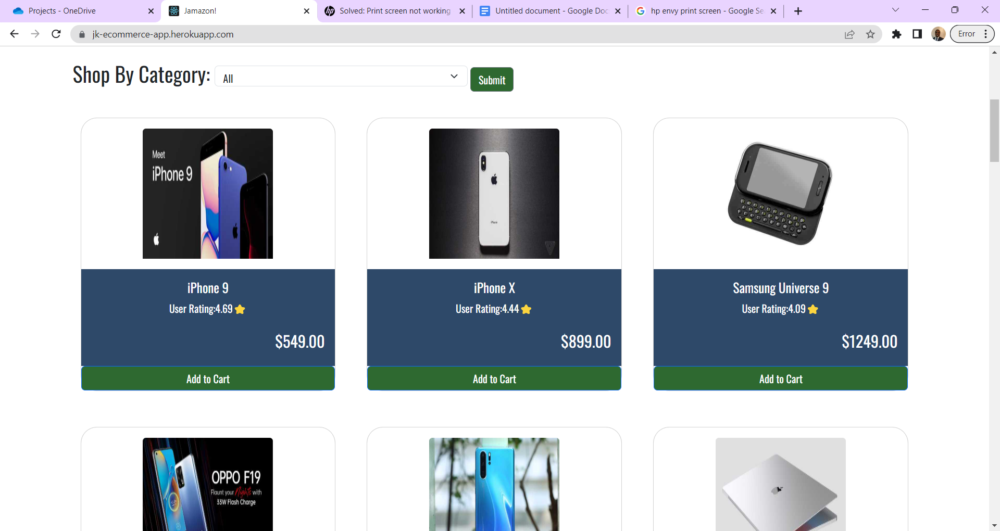

About the project
This is a basic e-commerce website built with Express, React, and Node and CSS. This website features a modern and intuitive design, with easy-to-use navigation 
and a simple shopping experience that puts the focus on the products.

Features:
Browse Items by Category
Add and delete items from the Shopping Cart
Stripe(test) is enabled to complete your purchases

👉 Live Demo: (https://jk-ecommerce-app.herokuapp.com/)

Screenshots of the Project 📸

